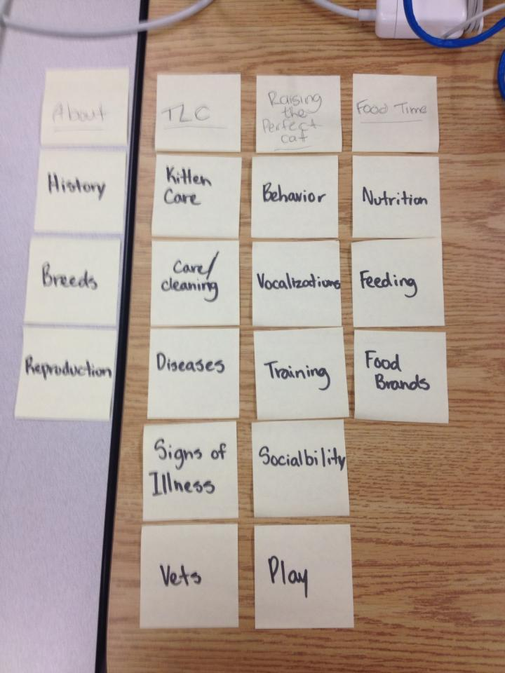
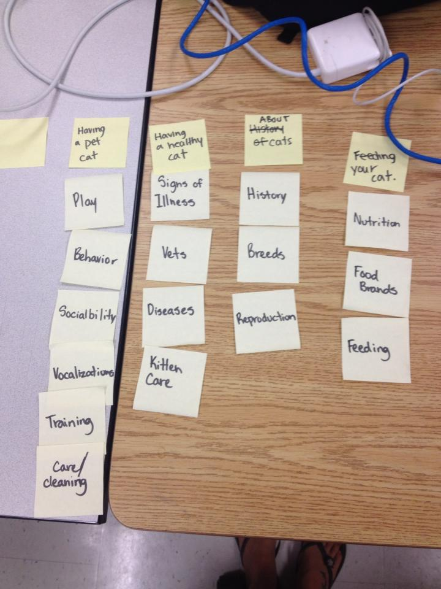

# Card sort report

The purpose of this card sort was to determine common navigation patterns and categories from the content of {your large data-oriented website}.

## Specifics

The card sort was conducted by Kelsey MacMillan on Sept.11th, 2013 between the times of 11:00am and 2:00pm with the following participants:

- Michelle Laurer
- Sarah Voss

### Cards

16 cards were used covering a broad range of applicable content for the website. The following topics were used as cards:

1. About Cats
2. Finding your perfect Cat
3. Having a Healthy Cat
4. Feeding your Cat
5. Tender Loving Care

## Card sort results

*Card sort 1 by Michelle Lauer*

*Card sort 2 by Sarah Voss*

## Observations

- Both participants had similar comments about organizing history into one content. 
- They didnt struggle with questions about the article or certain content.
- The groupings were *About Cats*, *how to take care of a cat*, and *feeding a cat*.
- One grouping I thought was kind of neat was the TLC, which stands for tender loving care. It was creative and I went through with using it.
- The results were similar to what I would propose myself because they were basic topics that would have a certain title, such as food brands would be under *feeding your cat*.
- When I was watching them perform the task it was interesting to see what kind of creative titles they used.